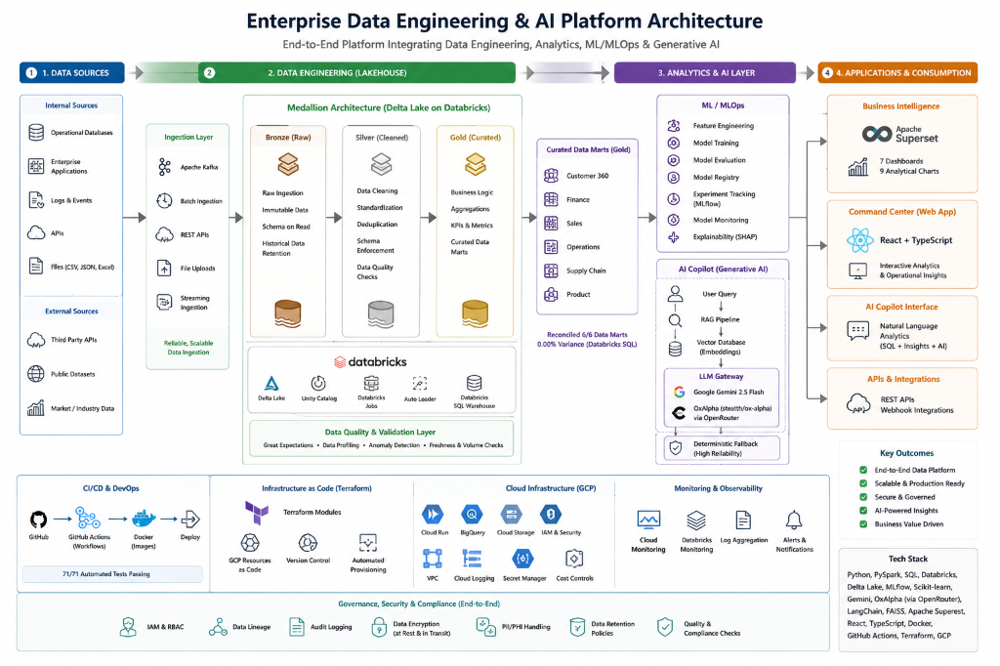

# 🏛️ Platform Architecture Specification

> **Official Classification**: `Release Candidate / Production-Like Prototype`

## 1. End-to-End System Topology



```
                  LIVE EXTERNAL DATA & EVENT STREAMING
           (Alpha Vantage, OpenAQ, RBI Macro, Redis Streams)
                                │
                                ▼
                   PYSPARK MEDALLION LAKEHOUSE
       Bronze (Raw Ingestion) ➔ Silver (Cleaned) ➔ Gold (Aggregated Marts)
                                │
        ┌───────────────────────┼───────────────────────┐
        ▼                       ▼                       ▼
DATABRICKS DELTA LAKE   POSTGRESQL / SQLITE      APACHE SUPERSET BI
(0.00% Variance Sync)   (Gold Data Marts)     (7 Dashboards, 9 Charts)
        │                       │                       │
        └───────────────────────┼───────────────────────┘
                                ▼
                   ENTERPRISE AI COPILOT & RAG
             Agentic Router ➔ AST Read-Only SQL Security
        Gemini 2.5 Flash / OxAlpha (OpenRouter) ➔ Fallback
```

---

## 2. Component Specifications

### 2.1 PySpark Medallion Lakehouse Pipeline
- **Bronze Stage**: Raw CSV/JSON ingestion adding metadata provenance, ingestion timestamps, and UUID primary keys.
- **Silver Stage**: Type casting, null cleaning, and schema validation (`get_credit_card_validator()`). Invalid rows are isolated into `data/quarantine/`.
- **Gold Stage**: Aggregates business KPIs across 6 sectors (Credit Card, Banking, Healthcare, Clinical, Insurance, Retail) written to Parquet and JSON in `data/lake/gold/`.

### 2.2 Databricks SQL Synchronization
- REST execution against Databricks SQL Warehouse (`1f1403d78bfa0404`).
- Automated schema reconciliation checking row counts and metric totals across all **6 Gold sector marts with 0.00% variance**.

### 2.3 MLOps & Predictive Risk Suite
- **Model Zoo**: XGBoost, LightGBM, Random Forest, Logistic Regression, and PyTorch Autoencoder trained across multi-sector benchmarks.
- **Explainability**: `shap.TreeExplainer` generates feature attributions and top 3 explanation reasons per transaction.
- **Drift Monitoring**: Population Stability Index (PSI) and Kolmogorov-Smirnov (KS) tests monitor feature distribution shifts in `ml/drift_monitor.py`.

### 2.4 Multi-Tier LLM Gateway & AST Security
- **Router (`AgenticRouter`)**: Classifies intents into ML Analysis, SQL Analytics, RAG Knowledge Retrieval, or Hybrid modes.
- **LLM Gateway Chain**: Google Gemini 2.5 Flash $\rightarrow$ OxAlpha (`stealth/ox-alpha`) via OpenRouter Gateway (**HTTP 200 Live Verified**) $\rightarrow$ Deterministic Analytics Engine Fallback. (Ollama completely removed).
- **AST SQL Security**: `sqlglot` AST parser validates LLM-generated SQL queries prior to execution, asserting root is `SELECT` and strictly blocking `DROP`, `DELETE`, `UPDATE`, or multi-statement injections.
- **RAG Pipeline**: Document loader, 300-character recursive chunker, HuggingFace embeddings (`all-MiniLM-L6-v2`), FAISS vector store, and citation output manifests.

### 2.5 Apache Superset BI & Command Center UI
- Native ORM Container Provisioner (`scripts/provision_superset_native.py`) programmatically registers assets via REST APIs.
- **Assets**: 1 Database (`Enterprise Analytics Engine`), 7 SqlaTable Datasets, 9 Slice Charts (`status=success`), 7 Published Dashboards on Docker `localhost:8088`.
- **Frontend**: Vite + React TypeScript interactive web app running on `localhost:3000`.

### 2.6 DevOps & CI/CD Boundary
- **GitHub Actions**: 4-job master workflow (`.github/workflows/ci.yml`) executing Python unit tests (71/71 PASS), Vite React build, and multi-stage Docker image builds with **Run #52 SUCCESS**.
- **Terraform GCP IaC Boundary**: Declared in `infrastructure/terraform/main.tf` for Google Cloud Run, Cloud Storage, and BigQuery. (IaC declared / local release candidate baseline; live GCP Cloud Run service intentionally unexecuted).
