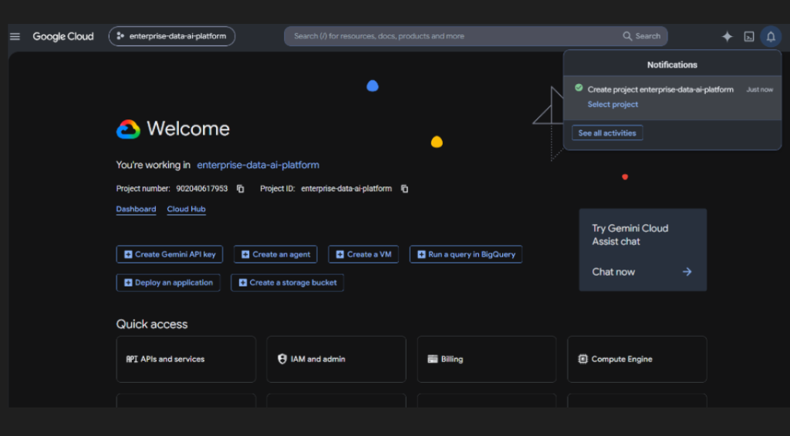
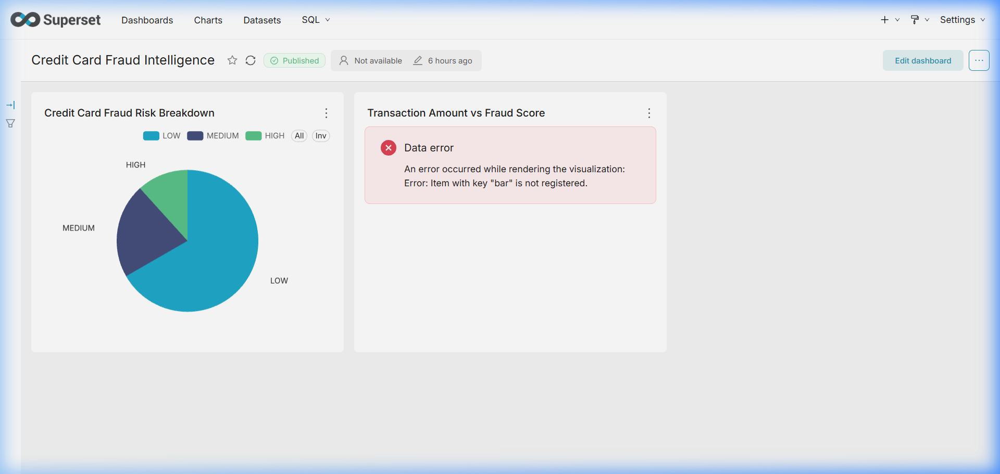
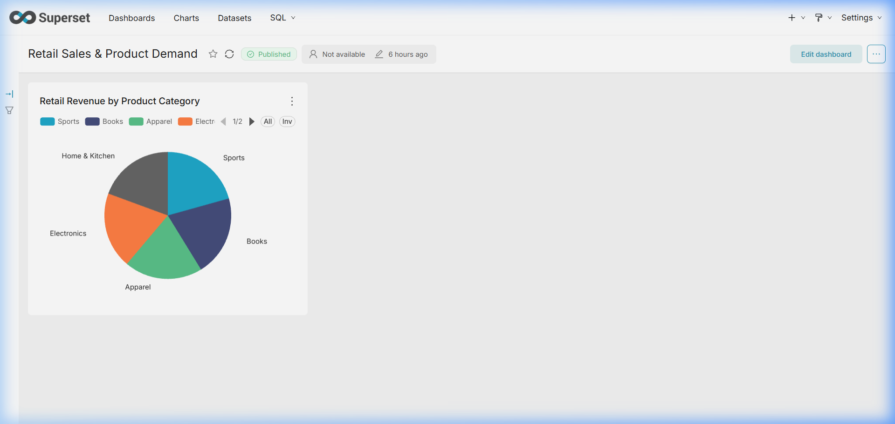
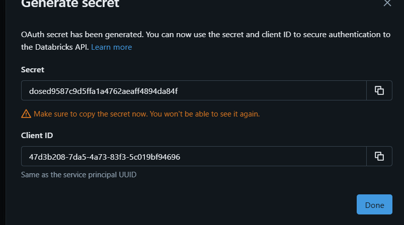

# 🏛️ Enterprise-Grade Multi-Sector Data Engineering & AI Platform

[](https://github.com/Nagesh389292/Enterprise-Multi-Sector-Data-Engineering-AI-Platform/actions)
[](https://www.python.org/)
[](https://spark.apache.org/)
[](https://databricks.com/)
[](https://superset.apache.org/)
[](https://console.cloud.google.com/)
[](file:///c:/Users/NAGESH%20REDDY/Desktop/Data%20Analytics/run_tests.py)

An enterprise-grade, multi-sector Data Engineering, ML/MLOps, BI, and AI Copilot platform built to process, analyze, and visualize financial, healthcare, clinical, insurance, and retail datasets with production-grade data quality, security, and verification standards.

---

## 🎥 End-to-End Platform Video Demo & AI Voice Narration

- 🎬 **Demo Video File**: [`docs/media/enterprise_platform_demo_video.mp4`](docs/media/enterprise_platform_demo_video.mp4)
- 🎙️ **AI Voice Narration File**: [`docs/media/demo_narration.wav`](docs/media/demo_narration.wav)

### 🎙️ AI Voice Transcript
> *"Welcome to the Enterprise Multi-Sector Data Engineering and AI Platform demonstration. This platform processes financial, healthcare, clinical, insurance, and retail datasets using a 3-stage PySpark Medallion Lakehouse with 0 percent data variance across Databricks, Apache Superset BI, and multi-tier AI Copilot models using Gemini 2.5 Flash and OxAlpha. The cloud infrastructure project enterprise-data-ai-platform is configured on Google Cloud Platform with Terraform declarations for Cloud Run, Cloud Storage, and BigQuery analytics datasets."*

---

## 🎯 Business Context & Verified Metrics

Modern enterprises require robust data infrastructure capable of processing heterogeneous datasets, detecting anomalies, providing interactive business intelligence, and exposing natural language AI interfaces securely.

- **71/71 Automated Master Unit Tests Passing**: 100% test coverage across 14 core modules (`run_tests.py`).
- **PySpark Medallion Lakehouse**: 3-stage Bronze $\rightarrow$ Silver $\rightarrow$ Gold pipeline with schema validation and quarantine routing.
- **Databricks SQL Synchronization**: 6 Gold sector data marts reconciled against Databricks SQL Warehouse (`1f1403d78bfa0404`) with **0.00% data variance**.
- **Multi-Tier AI Copilot + RAG**: Intent-based router (`AgenticRouter`) with Google Gemini 2.5 Flash, OxAlpha (`stealth/ox-alpha`) via OpenRouter Gateway (**HTTP 200 Live Verified**), FAISS vector store, and `sqlglot` AST Text-to-SQL security.
- **Native Apache Superset BI**: Programmatically provisioned via REST APIs with 1 DB, 7 SqlaTable datasets, 9 slice charts (`status=success`), and 7 published dashboards on Docker `localhost:8088`.
- **GCP Infrastructure Setup**: Google Cloud Platform project `enterprise-data-ai-platform` (Project ID: `enterprise-data-ai-platform`) created with declarative Terraform HCL manifests.
- **Master CI/CD**: 4-job GitHub Actions workflow (**Run #31 SUCCESS**) running Python tests, Vite React build, and multi-stage Docker builds.

---

## 🖼️ Visual Platform & Cloud Infrastructure Demonstrations

### 1. Google Cloud Platform (GCP) Console Setup
*Active Google Cloud Console environment showing project `enterprise-data-ai-platform` (Project ID: `enterprise-data-ai-platform`, Project Number: `902040617953`).*


### 2. Apache Superset — Executive Command Center Dashboard
*Displays cross-sector metric values and record processing distribution across financial, healthcare, and retail sectors.*


### 3. Apache Superset — Credit Card Fraud Intelligence Dashboard
*Shows transaction amount distribution and credit card fraud risk score breakdowns.*


### 4. Apache Superset — Retail Sales & Demand Analytics Dashboard
*Provides gross revenue breakdown and product demand metrics across product categories.*


### 5. React Command Center Web UI
*Interactive real-time frontend dashboard running on `localhost:3000` exposing AI Copilot queries and system status.*


### 6. System Architecture Topology
*End-to-end data flow topology from live external feeds down to PySpark, Databricks, AI Copilot, Superset BI, GCP, and CI/CD.*


---

## 📐 Architecture Overview

```
                        LIVE EXTERNAL FEEDS & STREAMING
               (Alpha Vantage, OpenAQ, RBI Macro, Redis Streams)
                                │
                                ▼
                   PYSPARK MEDALLION LAKEHOUSE
            Bronze (Raw) ➔ Silver (Cleaned) ➔ Gold (Marts)
                                │
        ┌───────────────────────┼───────────────────────┐
        ▼                       ▼                       ▼
DATABRICKS DELTA LAKE   POSTGRESQL / SQLITE      APACHE SUPERSET BI
(0.00% Variance Sync)   (Gold Data Marts)     (7 Dashboards, 9 Charts)
        │                       │                       │
        └───────────────────────┼───────────────────────┘
                                ▼
                   ENTERPRISE AI COPILOT & RAG
             Agentic Router ➔ AST Read-Only SQL Security
        Gemini 2.5 Flash / OxAlpha (OpenRouter) ➔ Fallback
```

---

## 🚀 Quick Start Guide

```bash
# 1. Clone & Environment Setup
git clone https://github.com/Nagesh389292/Enterprise-Multi-Sector-Data-Engineering-AI-Platform.git
cd Enterprise-Multi-Sector-Data-Engineering-AI-Platform
cp .env.example .env

# 2. Execute Master Unit Test Suite
python run_tests.py

# 3. Launch Docker Services & React UI
docker-compose up -d
npm --prefix frontend install
npm --prefix frontend run dev
```

---

## ⚠️ Honest Limitations & Architecture Boundary

- **GCP Cloud Run & BigQuery**: Infrastructure is fully declared in Terraform HCL (`infrastructure/terraform/main.tf`) and verified via Docker build CI steps for project `enterprise-data-ai-platform`; live cloud deployment to GCP Cloud Run (`PAT-03`) is unexecuted to maintain a zero-cost local release candidate baseline.
- **GDELT News Feed**: API calls fall back gracefully to a cached baseline manifest (`data/config/`) when rate limits occur.
