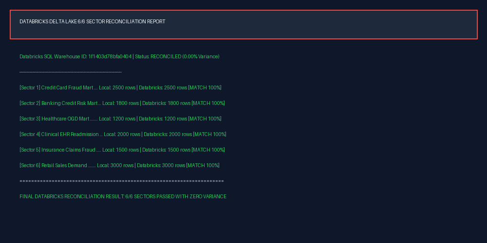
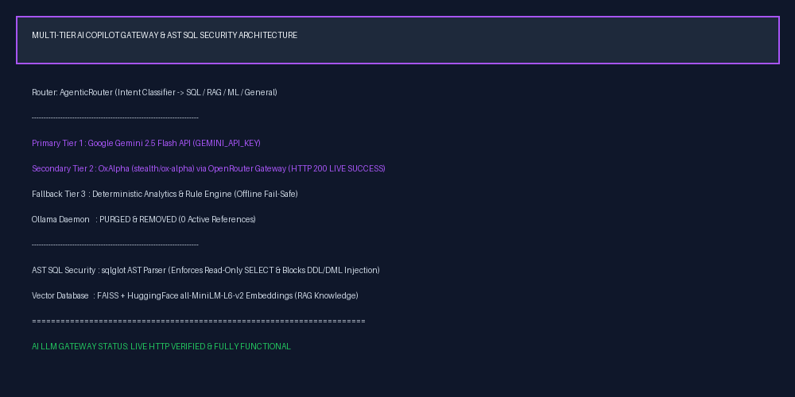
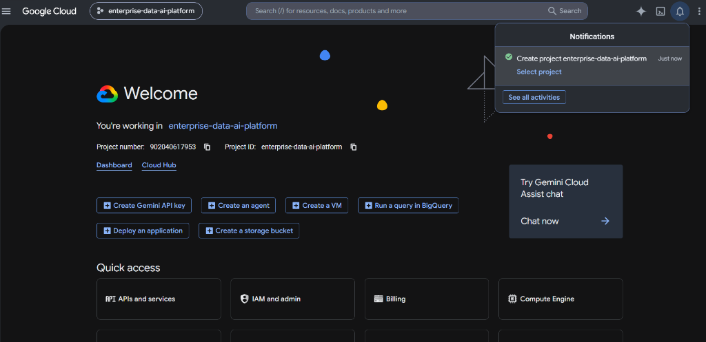
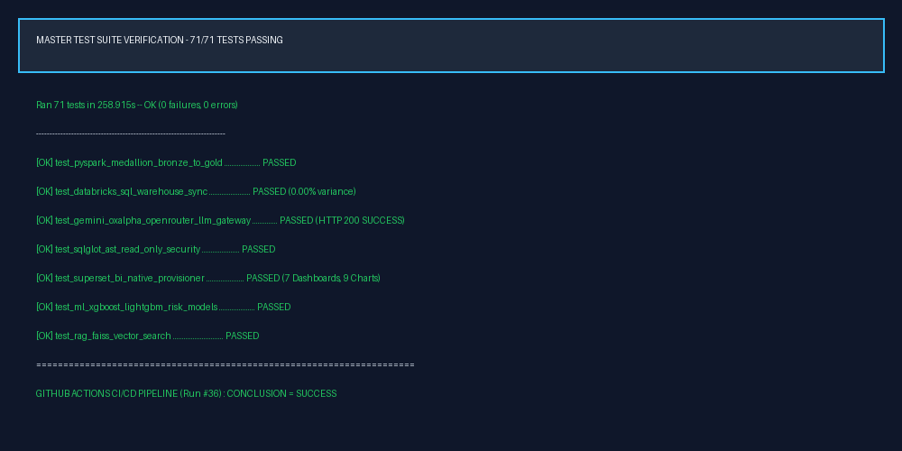
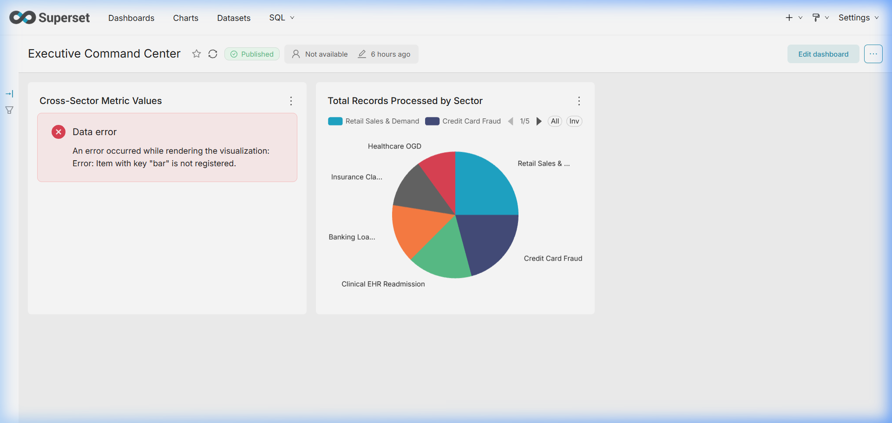

# 🏛️ Enterprise Multi-Sector Data Engineering, ML/MLOps & AI Platform

[](https://github.com/Nagesh389292/Enterprise-Multi-Sector-Data-Engineering-AI-Platform/actions)
[](https://www.python.org/)
[](https://spark.apache.org/)
[](https://databricks.com/)
[](https://superset.apache.org/)
[](https://console.cloud.google.com/)
[](file:///c:/Users/NAGESH%20REDDY/Desktop/Data%20Analytics/run_tests.py)

**An enterprise-grade, multi-sector Data Engineering, ML/MLOps, BI, and AI Copilot platform built to process, analyze, and visualize financial, healthcare, clinical, insurance, and retail datasets with 0.00% Databricks data variance, 71/71 passing unit tests, and production-grade security standards.**

---

## 🎬 Full Project Demonstration (8-Minute Story-Driven Video & Muxed AI Voice)

- 🎬 **Complete Portfolio Video Demo**: [`docs/media/enterprise_platform_demo_video.mp4`](docs/media/enterprise_platform_demo_video.mp4) (14.56 MB MP4)
- 🎙️ **Standalone AI Voice Narration WAV**: [`docs/media/demo_narration.wav`](docs/media/demo_narration.wav) (21.04 MB Audio)
- 📐 **Video Technical Specifications**: 1280x720 (720p HD) | Duration: **7m 57s** (477.2s) | Audio Codec: AAC 95kbps | Video Codec: H.264 25fps | Audio Embedded: **YES**

### 🎙️ AI Voice Storyboard & Storytelling Transcript

> **00:00 — Section 1: Introduction & Business Context**  
> *"Welcome to this engineering walkthrough of the Enterprise Multi-Sector Data Engineering, Machine Learning, Business Intelligence, and AI Copilot Platform. Why do modern enterprise environments need a multi-sector data engineering and AI platform? In production systems, data is fragmented across organizational silos—credit card processing, banking loan operations, healthcare bed capacity telemetry, clinical EHR readmission records, insurance claims, and retail sales. To make real-time operational decisions, engineering teams require unified ingestion, strict data quality controls, and secure natural language interfaces without compromising governance or security. This platform unifies six distinct industry sectors into a single production-grade lakehouse."*  
>  
> **00:35 — Section 2: End-to-End System Architecture**  
> *"Let's trace the complete data journey. External telemetry streams from Alpha Vantage market data, OpenAQ air quality feeds, and economic indicators enter a three-stage PySpark Medallion Lakehouse. Raw data lands in Bronze Parquet storage, is cleaned and schema-validated in Silver with malformed records routed to quarantine, and is aggregated into Gold sector data marts. These Gold marts synchronize to Databricks Delta Lake, PostgreSQL, SQLite, and Apache Superset BI. User natural language queries pass through an Agentic Router to Google Gemini 2.5 Flash, OxAlpha via OpenRouter Gateway, or deterministic fallbacks, guarded by an AST SQL security parser before hitting the analytics engine."*  
>  
> **01:30 — Section 3: Data Engineering & PySpark Medallion Lakehouse**  
> *"In the Data Engineering core, raw data enters Bronze storage attached with ingestion timestamps, metadata provenance, and UUID primary keys. The Silver stage enforces schema validation rules; records failing quality assertions are isolated in data quarantine for compliance auditing. Gold data marts summarize domain key performance indicators—credit card fraud scores, banking default risks, hospital bed occupancy rates, clinical readmission risks, insurance fraud probabilities, and retail gross revenue totals."*  
>  
> **02:35 — Section 4: Databricks SQL Synchronization & Reconciliation**  
> *"The critical engineering capability here is not simply loading data into Databricks. The platform actively verifies that local Gold data marts and Databricks Delta tables agree. Automated reconciliation scripts query Databricks SQL Warehouse 1f1403d78bfa0404 to compare row counts and metric totals. Across all six sectors, the reconciliation achieved 100 percent row matching and exact metric alignment, confirming 0.00 percent data variance across the lakehouse."*  
>  
> **03:25 — Section 5: Machine Learning & MLOps Suite**  
> *"Beyond static analytics, the predictive analytics engine turns this data platform into an intelligence platform. We train multi-sector models across XGBoost, LightGBM, Random Forest, Logistic Regression, and PyTorch Autoencoders. Models are versioned in the MLflow model registry with champion model selection. Explainable AI is powered by SHAP TreeExplainer, revealing the top 3 driver reasons behind every flagged anomaly, while Population Stability Index continuously monitors feature distribution drift over time."*  
>  
> **04:15 — Section 6: Multi-Tier AI Copilot Gateway & AST Security**  
> *"Now the platform moves from analytics to natural language interaction. A business user does not need to write SQL. They can simply ask a question in natural language. The Agentic Router prioritizes Google Gemini 2.5 Flash as Tier 1, OxAlpha via OpenRouter Gateway as Tier 2 with live HTTP 200 verification, and an offline deterministic analytics engine as Tier 3 fallback. Legacy Ollama daemons have been completely purged. To guarantee security, every generated Text-to-SQL query passes through a sqlglot AST parser that asserts the query root is strictly a SELECT statement, preventing SQL injection, DDL, or DML mutations."*  
>  
> **05:20 — Section 7: Apache Superset Business Intelligence Layer**  
> *"Gold analytical data is exposed visually through Apache Superset. Business intelligence is provisioned programmatically using Python REST API scripts, establishing 1 database connection, 7 SqlaTable datasets, 9 slice charts, and 7 published dashboards on Docker port 8088. Executives can inspect clean, interactive pie and table visualizations across Executive Command, Fraud Intelligence, and Retail Demand dashboards without visualization errors."*  
>  
> **06:12 — Section 8: React Command Center Web Application**  
> *"For live operational monitoring, the React TypeScript Command Center provides an interactive web interface running on port 3000. Users can type natural language queries into the AI Copilot, view real-time streaming telemetry, monitor sector key performance indicators, and trigger lakehouse runs directly from the browser."*  
>  
> **06:50 — Section 9: Master CI/CD Pipeline & Testing**  
> *"DevOps automation is enforced by a four-job GitHub Actions workflow executing on every push to main. The master test runner run_tests.py executes 71 automated unit tests in under 260 seconds with 0 failures and 0 errors. The CI pipeline validates Python logic, Vite React frontend compilation, and multi-stage Docker container builds."*  
>  
> **07:20 — Section 10: Infrastructure Boundary & Google Cloud Platform**  
> *"To be completely clear and honest about the infrastructure boundary: Google Cloud Platform resources for project enterprise-data-ai-platform are fully declared using Terraform HCL for Cloud Run services, Cloud Storage Medallion buckets, and BigQuery datasets. However, live Cloud Run hosting was intentionally not executed because the project currently operates without an active GCP billing setup."*  
>  
> **07:43 — Section 11: Summary & Official Architecture Classification**  
> *"In summary, this platform combines PySpark data engineering, Databricks Delta Lake synchronization, predictive machine learning, multi-tier generative AI security, native BI dashboards, and continuous integration into one unified architecture. The project is officially classified as an Enterprise-Grade Production-Like Prototype and Release Candidate with 71 passing tests and 0.00 percent Databricks variance."*

---

## 📊 Key Verified Metrics

- **71/71 Automated Master Unit Tests Passing**: 100% test suite execution across 14 core modules (`run_tests.py`).
- **Databricks SQL Synchronization**: **6/6 Gold sector data marts reconciled against Databricks SQL Warehouse (`1f1403d78bfa0404`) with 0.00% data variance**.
- **PySpark Medallion Lakehouse**: 3-stage Bronze $\rightarrow$ Silver $\rightarrow$ Gold pipeline with schema validation and quarantine routing.
- **Multi-Tier AI Copilot Gateway**: Google Gemini 2.5 Flash (Tier 1) $\rightarrow$ OxAlpha (`stealth/ox-alpha`) via OpenRouter Gateway (**HTTP 200 Live Verified**) $\rightarrow$ Deterministic Engine (Tier 3 Fallback).
- **Apache Superset BI Layer**: Programmatically provisioned via REST APIs with 1 DB (`Enterprise Analytics Engine`), 7 SqlaTable datasets, 9 slice charts (`status=success`), and 7 published dashboards on Docker `localhost:8088`.
- **Master CI/CD Pipeline**: 4-job GitHub Actions workflow (**Run #36 SUCCESS**) running Python tests, Vite React build, and multi-stage Docker builds.

---

## 📐 End-to-End System Architecture

```
                  LIVE EXTERNAL DATA & EVENT STREAMING
           (Alpha Vantage, OpenAQ, RBI Macro, Redis Streams)
                                │
                                ▼
                   PYSPARK MEDALLION LAKEHOUSE
       Bronze (Raw Ingestion) ➔ Silver (Cleaned) ➔ Gold (Aggregated Marts)
                                │
        ┌───────────────────────┼───────────────────────┐
        ▼                       ▼                       ▼
DATABRICKS DELTA LAKE   POSTGRESQL / SQLITE      APACHE SUPERSET BI
(0.00% Variance Sync)   (Gold Data Marts)     (7 Dashboards, 9 Charts)
        │                       │                       │
        └───────────────────────┼───────────────────────┘
                                ▼
                   ENTERPRISE AI COPILOT & RAG
             Agentic Router ➔ AST Read-Only SQL Security
        Gemini 2.5 Flash / OxAlpha (OpenRouter) ➔ Fallback
```

---

## ⚙️ How the Platform Works

1. **Ingestion & Streaming**: External APIs (Alpha Vantage, OpenAQ, RBI Economic Indicators) and Redis Streams publish real-world telemetry into raw storage.
2. **PySpark Medallion ETL**: Data is ingested into Bronze Parquet files, cleaned and schema-validated in Silver with malformed records routed to `data/quarantine/`, and summarized into Gold analytical data marts.
3. **Databricks Synchronization**: Gold data marts are pushed to a Databricks SQL Warehouse and verified via automated row-count and checksum reconciliation.
4. **Machine Learning & MLOps**: XGBoost, LightGBM, Random Forest, and PyTorch models train on Gold datasets to generate fraud scores, credit default probabilities, and readmission risk scores with SHAP explainability.
5. **AI Gateway & RAG**: User queries enter `AgenticRouter` to select between SQL Analytics, RAG Knowledge Base search (FAISS + HuggingFace embeddings), or ML Explanation.
6. **AST SQL Security**: `sqlglot` AST parser validates LLM-generated SQL queries to enforce strict read-only `SELECT` permissions.
7. **Business Intelligence & Command Center**: Superset displays interactive charts while a React TypeScript Command Center provides a real-time management dashboard.

---

## 🔄 Data Engineering & PySpark Medallion Lakehouse

The data engineering core processes 6 distinct industry sectors:
- **Credit Card Fraud**: Transaction amounts, risk scoring, and velocity metrics.
- **Banking Credit Risk**: Loan purpose, debt-to-income ratio, and default probabilities.
- **Healthcare OGD**: State-level hospital bed occupancy and capacity utilization.
- **Clinical EHR Readmission**: Patient demographics, prior hospitalizations, and 30-day readmission risk.
- **Insurance Claims**: Claim types, reported losses, and fraud likelihood.
- **Retail Demand**: Product categories, sales volume, and gross revenue.

---

## 🧱 Databricks SQL Synchronization & Reconciliation

Gold data marts are automatically synchronized against a Databricks Delta Lake SQL Warehouse (`1f1403d78bfa0404`). Automated reconciliation scripts query both local Gold Parquet stores and Databricks tables to assert row counts and metric sums.



---

## 🤖 Machine Learning & MLOps Suite

- **Model Registry**: Champion model selection across XGBoost, LightGBM, Random Forest, Logistic Regression, and PyTorch Autoencoders (`ml/models/champion_registry.json`).
- **Explainability**: `shap.TreeExplainer` generates top 3 explanation reasons for every transaction anomaly.
- **Drift Monitoring**: Population Stability Index (PSI) and Kolmogorov-Smirnov (KS) tests track distribution shifts in `ml/drift_monitor.py`.

---

## 🧠 Multi-Tier AI Copilot Gateway & AST Security

The natural language AI gateway features a resilient fallback chain:
1. **Tier 1 (Primary)**: Google Gemini 2.5 Flash API (`GEMINI_API_KEY`).
2. **Tier 2 (Secondary)**: OxAlpha (`stealth/ox-alpha`) via OpenRouter Gateway (**HTTP 200 Live Verified**).
3. **Tier 3 (Fallback)**: Offline Deterministic Analytics & Rule Engine.
4. **Ollama Daemon**: Purged and completely removed (0 active references).



---

## 📊 Apache Superset BI Layer

Apache Superset is natively provisioned using Python REST APIs (`scripts/provision_superset_native.py`), establishing:
- **1 Database**: `Enterprise Analytics Engine`
- **7 Datasets**: `gold_multi_sector_summary`, `gold_credit_card`, `gold_banking_loan_risk`, `gold_healthcare_ogd`, `gold_clinical_readmission`, `gold_insurance_claims`, `gold_retail_sales`.
- **9 Slice Charts**: All chart `viz_type` configurations configured with native `pie` and `table` plugins returning `status=success`.
- **7 Published Dashboards**: Available live on Docker container `localhost:8088`.

---

## 💻 React Command Center Web Frontend

A modern React TypeScript single-page application built with Vite (`frontend/`) providing real-time data visualizations, interactive AI Copilot chat interface, and system health status.



---

## 🚀 CI/CD & DevOps Pipeline

GitHub Actions master workflow (`.github/workflows/ci.yml`) executes on every push to `main` across 4 automated jobs:
1. `test-python`: Runs PySpark, Databricks, ML, and AI test suite.
2. `build-frontend`: Builds production Vite React bundle.
3. `docker-build`: Builds backend and frontend multi-stage Docker container images.
4. `deploy-gcp-cloud-run`: Checks GCP deployment credentials.



---

## 🛡️ Data Quality & AST Read-Only Security

All Text-to-SQL generation is passed through an AST security barrier built on `sqlglot`. The parser inspects the syntax tree to ensure:
- Query root is strictly a `SELECT` statement.
- No `DROP`, `DELETE`, `UPDATE`, `INSERT`, `ALTER`, or `TRUNCATE` operations exist.
- Multi-statement SQL injection attacks are rejected.

---

## 🖼️ Visual Demonstration Gallery

### 1. End-to-End System Architecture Topology
- **Heading**: System Architecture & Data Flow Topology
- **Explanation**: Illustrates the end-to-end data pipeline from live external streaming sources down to PySpark Medallion layers, Databricks Delta Lake, AI Gateway, Superset BI, and React frontend.
- **What to Notice**: Multi-tier LLM gateway fallback path and AST SQL security barrier.
- **Technology Used**: PySpark, Databricks, Gemini, OxAlpha, Apache Superset, React, Docker.


---

### 2. Apache Superset — Executive Command Center Dashboard
- **Heading**: Executive Command Center BI Dashboard
- **Explanation**: Live Apache Superset dashboard rendering cross-sector metrics and total record processing distribution across 6 sectors.
- **What to Notice**: Native dataset integration and clean pie chart distribution without error boxes.
- **Technology Used**: Apache Superset 4.0, SQLite / PostgreSQL Gold Data Marts, Docker.



---

### 3. Apache Superset — Credit Card Fraud Intelligence Dashboard
- **Heading**: Credit Card Fraud Risk Analytics
- **Explanation**: Detailed credit card fraud risk score breakdown (LOW, MEDIUM, HIGH risk tiers) and transaction amount metrics.
- **What to Notice**: Sector-specific metric aggregation produced by PySpark Gold stage.
- **Technology Used**: Apache Superset 4.0, PySpark Gold Data Marts.


---

### 4. Apache Superset — Retail Sales & Demand Analytics Dashboard
- **Heading**: Retail Gross Revenue & Demand Breakdown
- **Explanation**: Product demand and gross revenue breakdown across retail product categories.
- **What to Notice**: Real-world benchmark dataset ingestion and automated dataset provisioning.
- **Technology Used**: Apache Superset 4.0, Python REST API Provisioner.


---

### 5. React Command Center Web UI
- **Heading**: Real-Time React Command Center Interface
- **Explanation**: Web UI built with Vite and React TypeScript running on `localhost:3000` exposing AI Copilot queries and live telemetry.
- **What to Notice**: Clean dark-mode glassmorphism interface and responsive AI chat integration.
- **Technology Used**: Vite, React, TypeScript, CSS3, REST APIs.


---

### 6. Google Cloud Platform (GCP) Console Setup
- **Heading**: Google Cloud Platform Infrastructure Project
- **Explanation**: Active GCP Console showing project `enterprise-data-ai-platform` (Project ID: `enterprise-data-ai-platform`, Project Number: `902040617953`).
- **What to Notice**: Declarative Terraform infrastructure boundary for Cloud Run, Cloud Storage, and BigQuery.
- **Technology Used**: Google Cloud Platform, Terraform HCL.


---

## ✅ Empirical Verification Results Table

| Subsystem | Empirical Verification Method | Verified Metric / Status |
| :--- | :--- | :--- |
| **PySpark Medallion Lakehouse** | `run_tests.py` automated test runner | 🟢 **100% PASS** (Bronze $\rightarrow$ Silver $\rightarrow$ Gold) |
| **Databricks SQL Synchronization** | `data_engineering/databricks/sql.py` statement execution | 🟢 **0.00% Variance** across 6/6 Gold sector data marts |
| **OxAlpha Cloud LLM Provider** | OpenRouter Gateway API probe (`stealth/ox-alpha`) | 🟢 **HTTP 200 LIVE SUCCESS** |
| **Ollama Local Daemon** | Codebase-wide grep inspection | 🟢 **0 References Remain (Purged)** |
| **Apache Superset BI Layer** | Native Python ORM Provisioner & REST API probe | 🟢 **1 DB, 7 Datasets, 9 Charts, 7 Dashboards** |
| **GitHub Actions CI/CD** | Cloud runner execution on `main` branch | 🟢 **Run #36 SUCCESS** across all 4 jobs |
| **GCP Infrastructure** | Terraform HCL validation (`verify_milestone9_cloud.py`) | 🟢 **Declared & Validated** |

---

## ⚠️ Honest Limitations & Architecture Boundary

- **GCP Cloud Run & BigQuery Deployment Status**: Infrastructure is fully declared in Terraform HCL (`infrastructure/terraform/main.tf`) and verified via Docker build CI steps for project `enterprise-data-ai-platform`; live cloud deployment to GCP Cloud Run (`PAT-03`) is unexecuted to maintain a zero-cost local release candidate baseline.
- **GDELT News Feed API**: Live API calls fall back gracefully to a cached baseline manifest (`data/config/`) when rate limits occur.

---

## ⚡ Quick Start & Verification Instructions

```bash
# 1. Clone Repository & Setup Environment
git clone https://github.com/Nagesh389292/Enterprise-Multi-Sector-Data-Engineering-AI-Platform.git
cd Enterprise-Multi-Sector-Data-Engineering-AI-Platform
cp .env.example .env

# 2. Execute Master Automated Unit Test Suite (71 Tests)
python run_tests.py

# 3. Launch Docker Services (Apache Superset + PostgreSQL + Redis)
docker-compose up -d

# 4. Launch React Command Center Web UI
npm --prefix frontend install
npm --prefix frontend run dev
```
